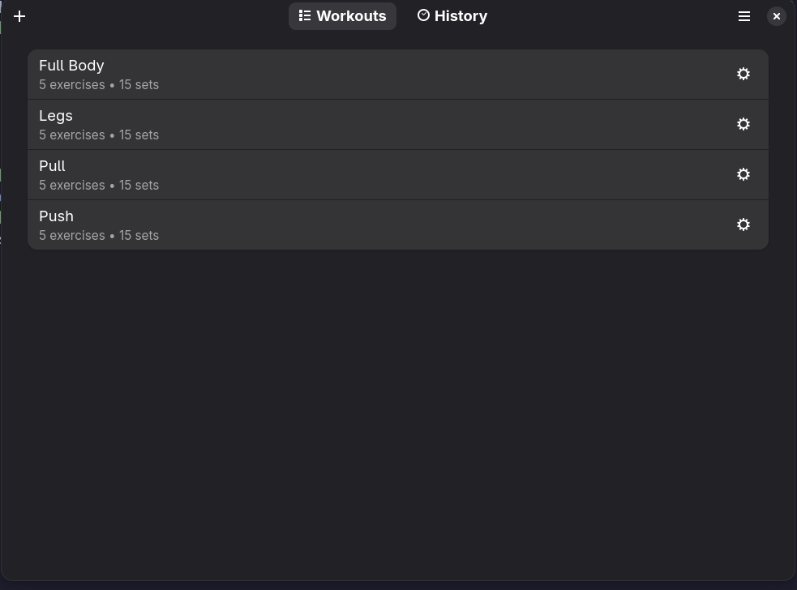

# Workouts

A workout tracker designed for gnome using PyGObject. You can create workout plans, perform them, and review your training history.



## Features

- Create and manage workout plans with exercises and sets
- Log reps, weight, and rest times during a workout session
- Superset support
- Training history with a calendar view

## Installation

I want to get this up on flathub but in the mean time you can build and install it locally using Flatpak:

```bash
flatpak-builder --user --install --force-clean _flatpak_build io.github.AronCalvert.Workouts.yml
flatpak run io.github.AronCalvert.Workouts
```

You can also build from source which needs these dependencies

### Dependencies

- Meson
- Python
- GTK4
- Libadwaita
- PyGObject

On Fedora :

```bash
sudo dnf install meson python3-gobject gtk4 libadwaita
```

```

## License

I'm using the [GPL-3.0-or-later](LICENSE.md).
