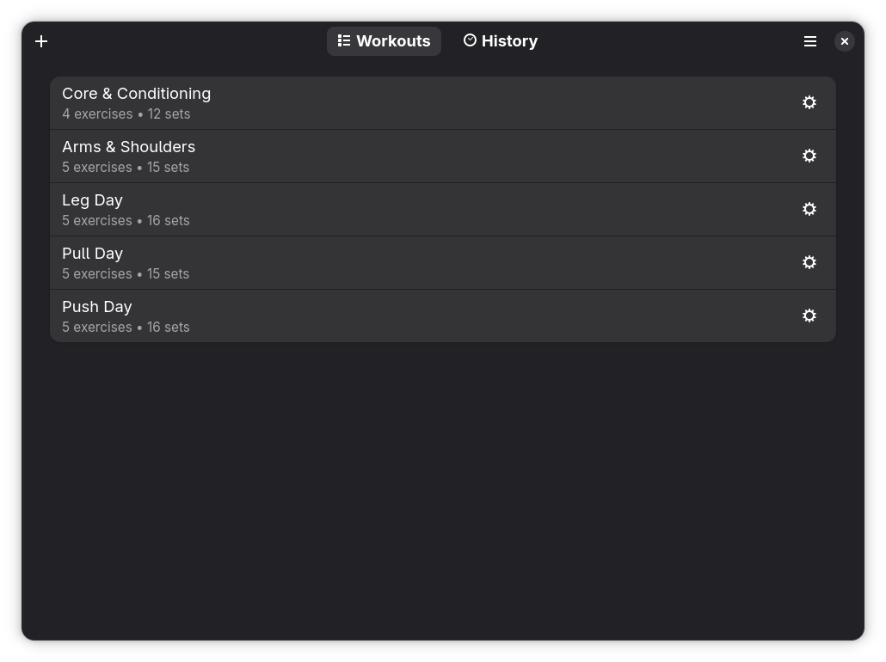
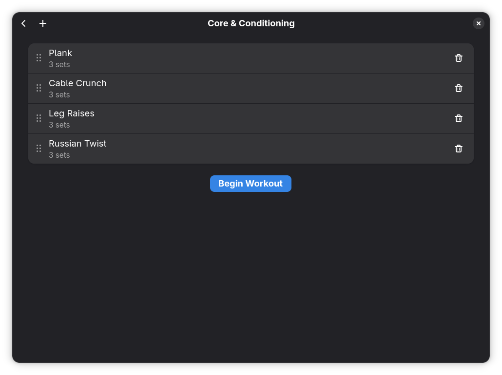
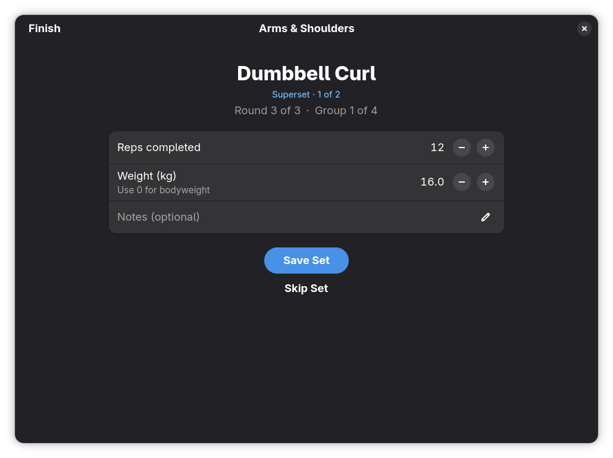
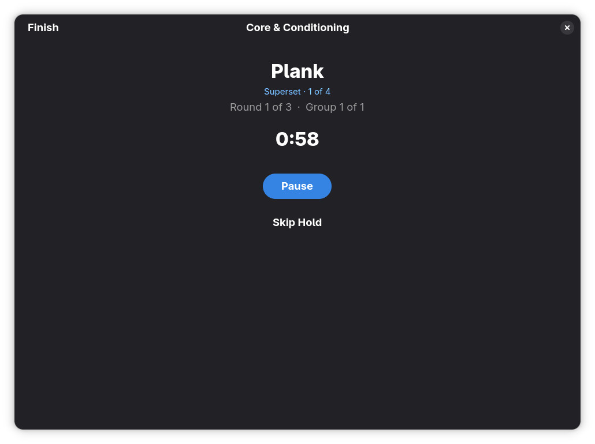
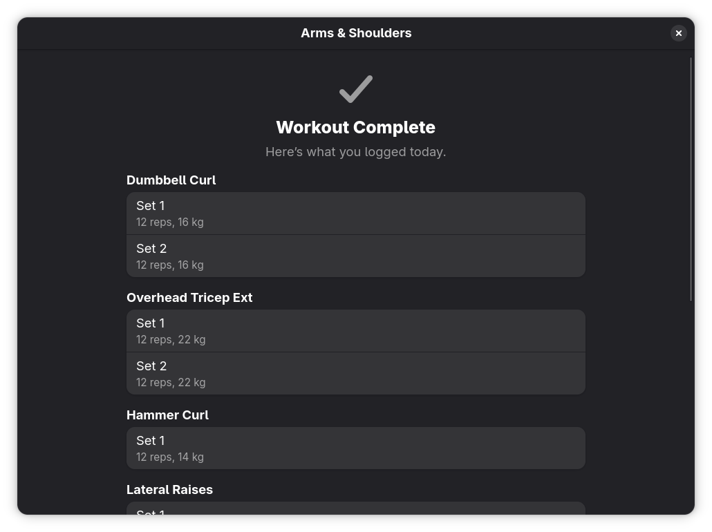
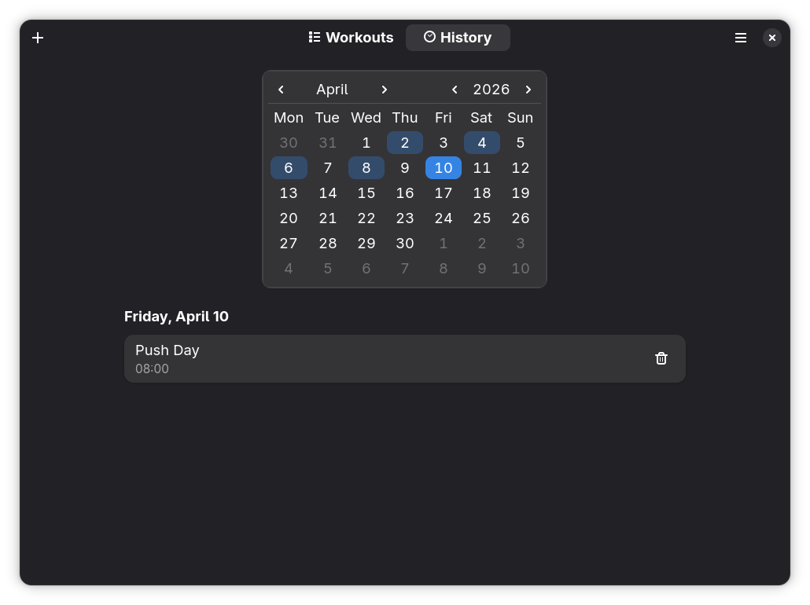

# Workouts

A workout tracker designed for GNOME using PyGObject. Create workout plans, perform them, and review your training history.



## Screenshots







## features

- You can create and manage workout plans with exercises and sets
- Log reps, weight, and rest times during a workout session
- superset support
- Timed hold exercises with countdown
- Training history to track yur progress

## Installation

I want to get this up on Flathub but in the meantime you can build and install it locally using Flatpak:

```bash
flatpak-builder --user --install --force-clean _flatpak_build io.github.AronCalvert.Workouts.yml
flatpak run io.github.AronCalvert.Workouts
```

or just clone the repo and run like this. (to do add dependencies)

```bash
cd gnome_workouts
python3 -m src
```

## License

[GPL-3.0-or-later](LICENSE)
